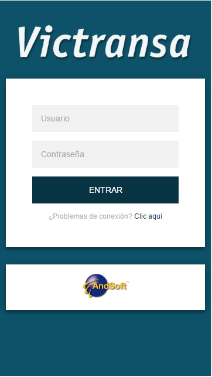

# Login ERP - Victransa - [Demo](https://arnedo5.github.io/Login)

**Historia**

VICTRANSA fue fundada el año 1984 como resultado de la fusión de dos empresas de ámbito regional que, originariamente, hacían el servicio entre las localidades de Vic y Barcelona. Su rápido crecimiento y su evolución han permitido que en estos momentos se ofrezcan servicios de entrega al España, Portugal, Francia, Italia, Inglaterra, Bélgica, Holanda, Suecia, Noruega, Suiza, Áustria, Dinamarca, Alemania, Polonia, República Checa, Eslovaquia, Hungria, Marruecos y Túnez.

Nuevo login para la ERP de [Victransa](http://red.victransa.com). Nuevo estilo sencillo.

**Lista de incorporaciones**
- [x] Deteccion automàtica del navegador en el cual se està ejecutando la página web.
- [x] Transiciones al detectar el navegador <del>Internet Explorer</del>

**Futuras funcionalidades**
- [ ] Implementar pàgina de conexión fallida
- [ ] Implementar pàgina de los errores de connexión màs habituales.

    

## Sobre el creador

  Arnedo5

  * [Facebook](https://www.facebook.com)
  * [Instagram](https://www.instagram.com)
  * [Google Plus](https://www.google.com)
  

